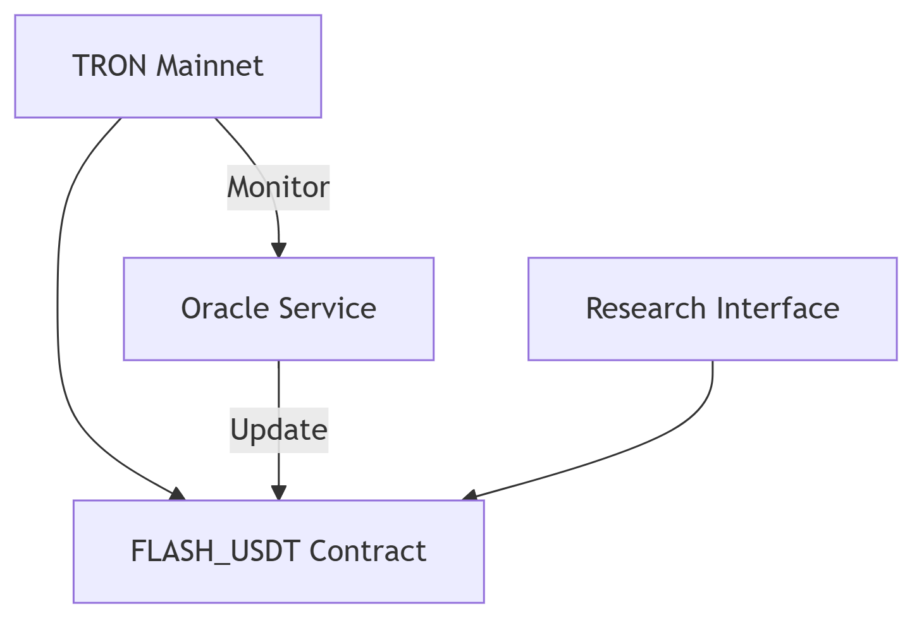

# Flash CryptoCurrency

**Flash CryptoCurrency** is a blockchain research project designed to simulate the operational behavior of **TRC20-USDT** using a custom smart contract deployed on the **TRON Blockchain**. The purpose is to build a secure, reliable, and educational environment for analyzing, testing, and understanding real-world token dynamics without interacting with the official TRC20-USDT protocol.

> 📘 This is a simulation tool, not a financial product. It does **not replicate, replace, or interfere** with the real USDT token or any live blockchain contracts.

---

## 🔍 Project Overview

Flash CryptoCurrency (symbol: `FLASH_USDT`) mirrors the behavior of TRC20-USDT using live market and blockchain data. This simulation is powered by a dynamic TRC20 smart contract and a centralized Oracle, which fetches real-time USDT data from trusted sources like TRONSCAN and CoinGecko.

---

## 💡 Key Features

- **Real-Time Behavior Tracking**  
  Replicates live data from the official TRC20-USDT contract.

- **Dynamic State Modification**  
  FLASH_USDT updates token state (e.g., `totalSupply`) using Oracle feeds.

- **TRC20-Compliant Smart Contract**  
  Fully functional and compatible with the TRON ecosystem.

- **Educational and Research-Oriented**  
  Ideal for testing, research, smart contract behavior analysis, and blockchain education.

- **Secure Oracle Integration**  
  Centralized Oracle component updates values while maintaining strict access control.

- **Modular Architecture**  
  Separates smart contract logic, Oracle processing, and external data streams.

---

## 🧠 Technical Concept

The FLASH_USDT system is structured to allow internal values like token supply and balances to dynamically change based on external data.

- The smart contract is TRC20-compliant, with additional methods to allow updates to specific simulated variables.
- An Oracle fetches live data from the official TRC20-USDT and pushes it to FLASH_USDT.
- The system does **not** attempt to copy, replace, or interfere with the real USDT token.
- Contract identity is separate. Wallets will recognize FLASH_USDT by its own unique contract address, not as the official USDT.

---

## 🏗️ Architecture Diagram

**Components:**
- **Smart Contract (FLASH_USDT):** Simulates TRC20-USDT logic with Oracle-controlled variables.
- **Oracle:** Fetches live data from official USDT sources and updates FLASH_USDT.
- **TRON Blockchain:** Hosts and executes the smart contract using TVM (TRON Virtual Machine).

---

## 📄 Full Technical Documentation

For a complete breakdown of the smart contract logic, Oracle implementation, TRC20 compliance, and blockchain behavior simulation, see the [full documentation (PDF)](file.pdf).

---

## 📌 Disclaimer

This project is created **strictly for educational and analytical use**. It does **not** represent or attempt to replicate the official USDT token. It will never appear in wallets or explorers as TRC20-USDT.

---

## 📞 Contact Information

If you are interested in the project, collaboration, or further explanation:

- **WhatsApp:** [+8801317558946](https://wa.me/8801317558946)  
- **Telegram:** [t.me/jhalphadev](https://t.me/jhalphadev)

---

## 📢 Tags (SEO Keywords)

TRC20 token simulation, Flash Cryptocurrency, TRON smart contract, USDT behavior analysis, TRON Virtual Machine, Oracle blockchain integration, blockchain research, dynamic TRC20 tokens, smart contract simulation, educational token project, TRC20-USDT replica, decentralized testnet token, blockchain data replication, crypto oracle system, simulated TRON token.

---

© 2025 Jahidul Hasan Numan. All rights reserved.
